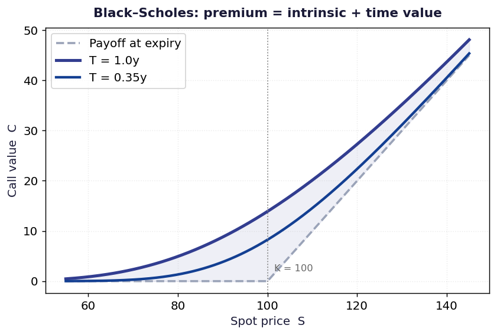

# Black-Scholes Option Pricing

European call and put prices, no-arbitrage bounds, and implied volatility solved with Brent's method.



## Run

```bash
pip install -r ../requirements.txt
py -3 model.py
```

Charts are written to `charts/`.

## What is inside

- Files: notebook + model.py
- Data: Analytic, worked example inputs

## Write-up

Full explanation, step by step, with the charts: [https://davidariasfinance.com/scripts/black-scholes-model/](https://davidariasfinance.com/scripts/black-scholes-model/)

## References

- [Black & Scholes (1973), The Pricing of Options and Corporate Liabilities](https://doi.org/10.1086/260062)

## License

MIT, see [LICENSE](../LICENSE).
