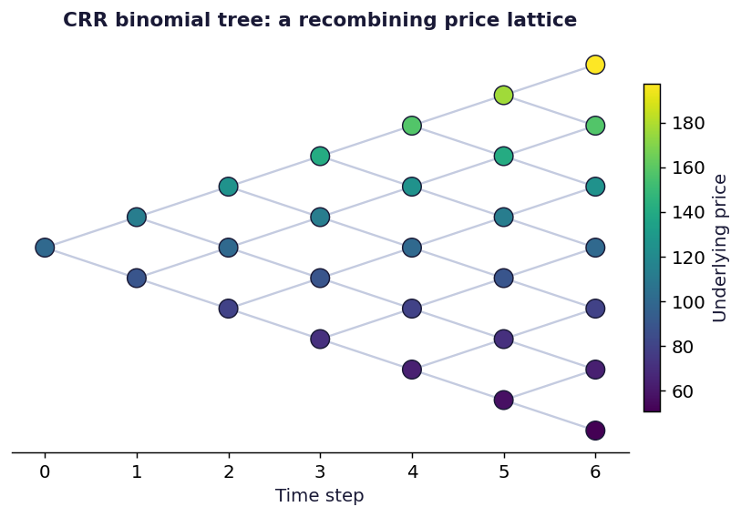

# CRR Binomial Tree

Cox, Ross and Rubinstein trees for European and American options, early exercise detection and convergence to Black-Scholes.



## Run

```bash
pip install -r ../requirements.txt
py -3 model.py
```

Charts are written to `charts/`.

## What is inside

- Files: notebook + model.py
- Data: None, runs offline

## Write-up

Full explanation, step by step, with the charts: [https://davidariasfinance.com/scripts/crr-binomial-tree/](https://davidariasfinance.com/scripts/crr-binomial-tree/)

## References

- [Cox, Ross & Rubinstein (1979), Option Pricing: A Simplified Approach](https://doi.org/10.1016/0304-405X(79)90015-1)

## License

MIT, see [LICENSE](../LICENSE).
