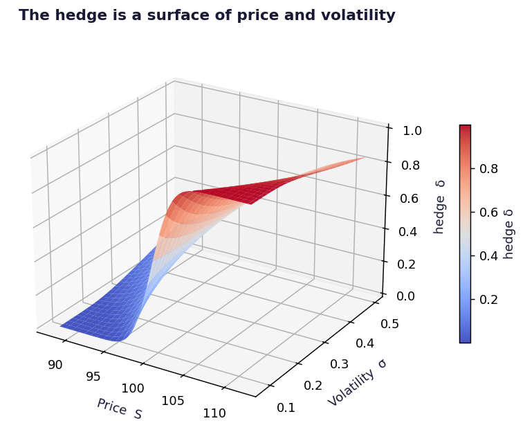

# Deep Hedging

A small network learns to hedge a call spread from simulated paths, judged on tail risk instead of on matching the Black-Scholes delta.



## Run

```bash
pip install -r ../requirements.txt
py -3 model.py
```

Charts are written to `charts/`.

## What is inside

- Files: model.py
- Data: Simulated GBM paths

## Write-up

Full explanation, step by step, with the charts: [https://davidariasfinance.com/scripts/deep-hedging/](https://davidariasfinance.com/scripts/deep-hedging/)

## References

- [Buehler, Gonon, Teichmann & Wood (2019), Deep Hedging](https://arxiv.org/abs/1802.03042)

## License

MIT, see [LICENSE](../LICENSE).
