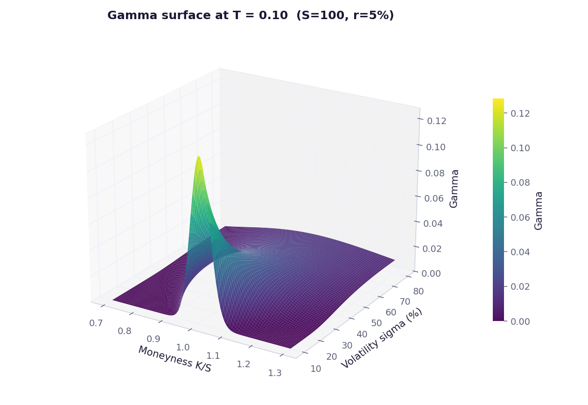

# Gamma Surface

Gamma across spot, strike, volatility and time, plus the gamma and theta trade-off, zomma and vanna.



## Run

```bash
pip install -r ../requirements.txt
py -3 model.py
```

Charts are written to `charts/`.

## What is inside

- Files: model.py
- Data: Simulated Black-Scholes grid

## Write-up

Full explanation, step by step, with the charts: [https://davidariasfinance.com/scripts/gamma-surface/](https://davidariasfinance.com/scripts/gamma-surface/)

## References

- Write-up: https://davidariasfinance.com/scripts/gamma-surface/

## License

MIT, see [LICENSE](../LICENSE).
