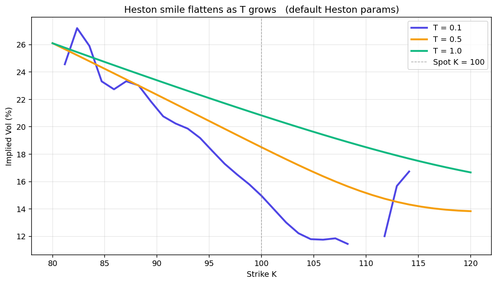

# Heston Volatility Surface

Stochastic volatility priced by characteristic function integration, then inverted into an implied volatility surface.



## Run

```bash
pip install -r ../requirements.txt
py -3 model.py
```

Charts are written to `charts/`.

## What is inside

- Files: heston_vol_surface.py (engine) + model.py (charts)
- Data: None, runs offline

## Write-up

Full explanation, step by step, with the charts: [https://davidariasfinance.com/scripts/heston-vol-surface/](https://davidariasfinance.com/scripts/heston-vol-surface/)

## References

- [Heston (1993), A Closed-Form Solution for Options with Stochastic Volatility](https://doi.org/10.1093/rfs/6.2.327)
- [Albrecher et al. (2007), The Little Heston Trap](https://doi.org/10.21314/JCF.2007.174)

## License

MIT, see [LICENSE](../LICENSE).
