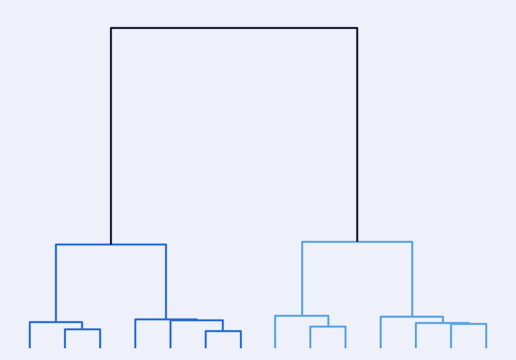

# Hierarchical Risk Parity

Lopez de Prado's HRP reproduced: cluster the correlation matrix, then allocate down the tree instead of inverting the covariance matrix.



## Run

```bash
pip install -r ../requirements.txt
py -3 model.py
```

Charts are written to `charts/`.

## What is inside

- Files: notebook + model.py + data/prices.csv
- Data: prices.csv included (792 KB), or yfinance

## Write-up

Full explanation, step by step, with the charts: [https://davidariasfinance.com/scripts/hierarchical-risk-parity/](https://davidariasfinance.com/scripts/hierarchical-risk-parity/)

## References

- [Lopez de Prado (2016), Building Diversified Portfolios that Outperform Out of Sample](https://doi.org/10.3905/jpm.2016.42.4.059)

## License

MIT, see [LICENSE](../LICENSE).
