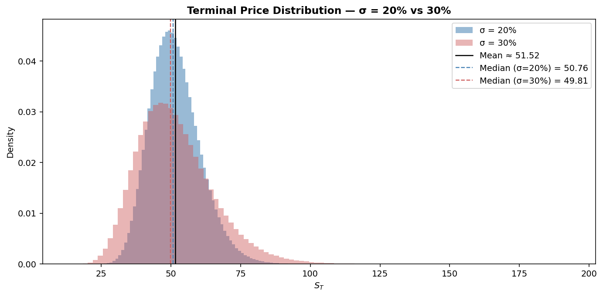

# Monte Carlo Option Pricing

Ten million simulated paths under geometric Brownian motion, with antithetic variates and the convergence check against the closed form.



## Run

```bash
pip install -r ../requirements.txt
py -3 model.py
```

Charts are written to `charts/`.

## What is inside

- Files: notebook + model.py
- Data: Simulated GBM paths, ten million

## Write-up

Full explanation, step by step, with the charts: [https://davidariasfinance.com/scripts/monte-carlo-gbm/](https://davidariasfinance.com/scripts/monte-carlo-gbm/)

## References

- [Glasserman, Monte Carlo Methods in Financial Engineering](https://doi.org/10.1007/978-0-387-21617-1)

## License

MIT, see [LICENSE](../LICENSE).
