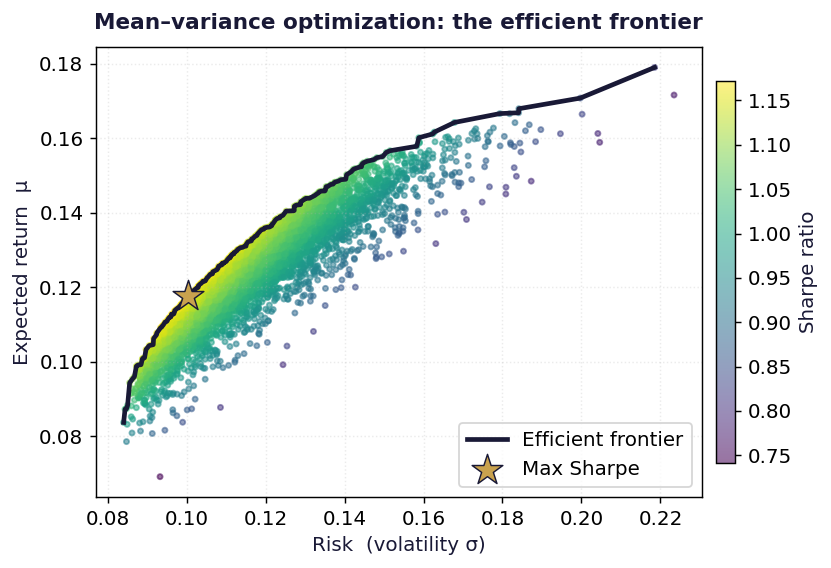

# Mean Variance Optimization

Markowitz optimization end to end: efficient frontier, maximum Sharpe portfolio, constrained allocation and backtest.



## Run

```bash
pip install -r ../requirements.txt
jupyter notebook notebook.ipynb
```

Charts are written to `charts/`.

## What is inside

- Files: notebook
- Data: yfinance, plus a free FRED key in FRED_API_KEY for the risk free rate

## Write-up

Full explanation, step by step, with the charts: [https://davidariasfinance.com/scripts/mvo-portfolio-optimization/](https://davidariasfinance.com/scripts/mvo-portfolio-optimization/)

## References

- [Markowitz (1952), Portfolio Selection](https://doi.org/10.2307/2975974)

## License

MIT, see [LICENSE](../LICENSE).
