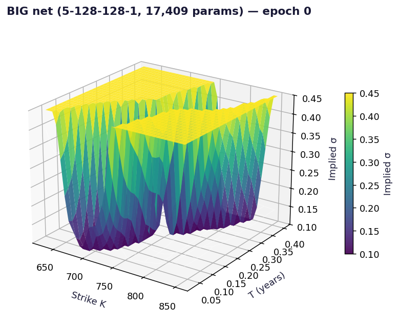

# Neural Network Volatility Surface

Two numpy MLPs, written from scratch, learn the SPY implied volatility surface from a real option chain.



## Run

```bash
pip install -r ../requirements.txt
py -3 model.py
```

Charts are written to `charts/`.

## What is inside

- Files: notebook + model.py + data/spy_chain.csv
- Data: Real SPY option chain, snapshot included

## Write-up

Full explanation, step by step, with the charts: [https://davidariasfinance.com/scripts/neural-network-vol-surface/](https://davidariasfinance.com/scripts/neural-network-vol-surface/)

## References

- Write-up: https://davidariasfinance.com/scripts/neural-network-vol-surface/

## License

MIT, see [LICENSE](../LICENSE).
