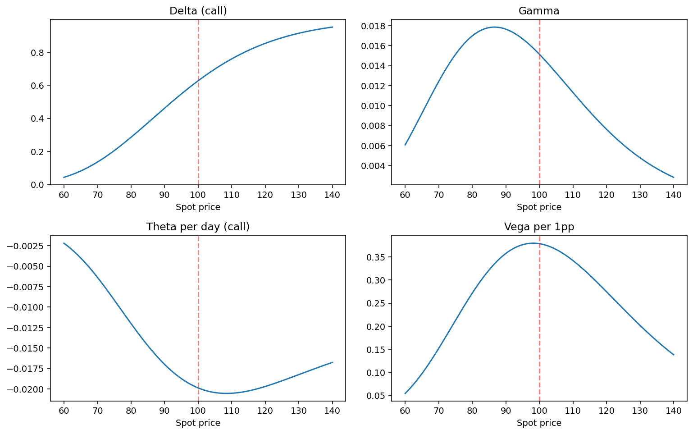

# Option Greeks

Delta, gamma, theta, vega and rho in Python, with the curves that show how each one behaves across spot and time.



## Run

```bash
pip install -r ../requirements.txt
py -3 model.py
```

Charts are written to `charts/`.

## What is inside

- Files: model.py
- Data: None, runs offline

## Write-up

Full explanation, step by step, with the charts: [https://davidariasfinance.com/scripts/option-greeks/](https://davidariasfinance.com/scripts/option-greeks/)

## References

- [Hull, Options, Futures and Other Derivatives, ch. 19](https://www-2.rotman.utoronto.ca/~hull/)

## License

MIT, see [LICENSE](../LICENSE).
