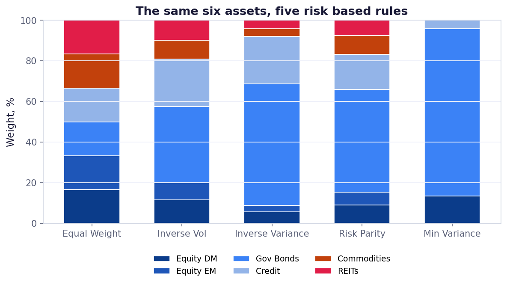

# Risk Based Allocation

Five allocation rules compared on the same ETF universe: HRP, HCAA, naive risk parity, minimum variance and equal weight, including a GARCH covariance variant.



## Run

```bash
pip install -r ../requirements.txt
py -3 model.py
```

Charts are written to `charts/`.

## What is inside

- Files: notebook + model.py + data/prices_part2.csv
- Data: prices_part2.csv included (977 KB), or yfinance

## Write-up

Full explanation, step by step, with the charts: [https://davidariasfinance.com/scripts/risk-based-allocation/](https://davidariasfinance.com/scripts/risk-based-allocation/)

## References

- [Raffinot (2017), Hierarchical Clustering Based Asset Allocation](https://doi.org/10.3905/jpm.2018.44.2.089)

## License

MIT, see [LICENSE](../LICENSE).
