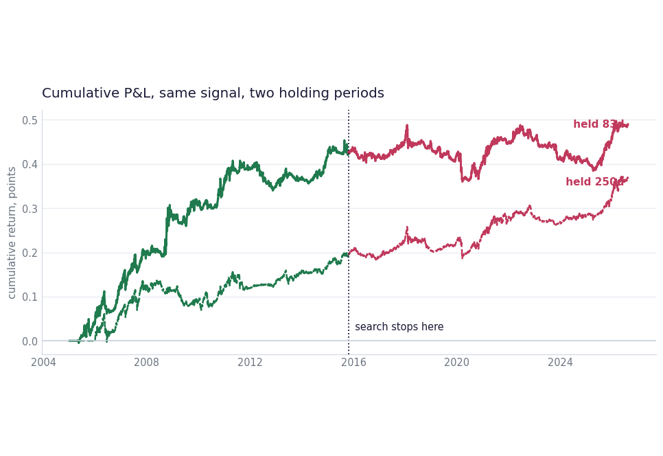

# Time Series Momentum

Moskowitz, Ooi and Pedersen reproduced on 45 free ETFs from 2005, with a 990 setting sweep of lookback against holding period, scored in sample and then out of sample.



## Run

```bash
pip install -r ../requirements.txt
py -3 model.py
```

Out-of-sample results come out far weaker than in sample, and the write-up says so. That gap is the point of the exercise.

## What is inside

- Files: model.py (the sweep) and bt_data.py (the loader)
- Data: Free ETF prices via yfinance, cached locally on the first run

## Write-up

Full explanation, step by step, with the charts: [https://davidariasfinance.com/scripts/time-series-momentum/](https://davidariasfinance.com/scripts/time-series-momentum/)

## License

MIT, see [LICENSE](../LICENSE).
