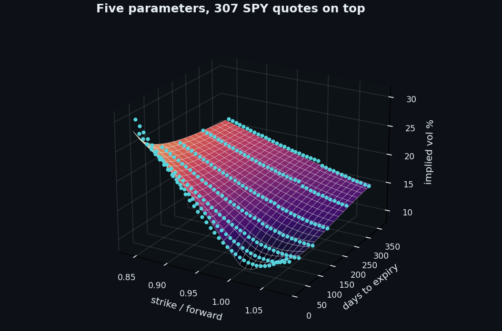

# Volatility and Option Models

Five models that each attack volatility from a different side: a trade that buys or sells it, a
model that bends it across strikes, a forecast of where it goes next, a network that hedges
against it, and a strategy that harvests the premium buyers pay for it. Real market data
throughout, and every model set against something simpler that it has to beat.



## Run

```bash
pip install -r ../requirements.txt
py -3 straddle_calendar.py
py -3 heston_calibration.py
py -3 gjr_garch.py
py -3 deep_hedging.py        # needs torch, a GPU helps
py -3 vix_basis_trade.py
```

## What is inside

| Script | Model | Data |
|---|---|---|
| [straddle_calendar.py](straddle_calendar.py) | Long and short straddle, calendar spread, time decay of each leg | SPY chain, Cboe delayed quotes |
| [heston_calibration.py](heston_calibration.py) | Heston calibrated to seven smiles, against one Black-Scholes vol | SPY chain, Cboe delayed quotes |
| [gjr_garch.py](gjr_garch.py) | GJR-GARCH with Student t errors, out of sample against the VIX | SPY and ^VIX, yfinance |
| [deep_hedging.py](deep_hedging.py) | Neural network hedging a short call under trading costs, CVaR objective | simulated GBM paths |
| [vix_basis_trade.py](vix_basis_trade.py) | Short VIX futures only in contango | ^VIX, ^VIX3M, ^SHORTVOL, yfinance |
| [cboe_chain.py](cboe_chain.py) | Chain download, forward from parity, Black 76 implied vol | shared by the first two |

## Results in the write-up

Option numbers come from the chain at the 2026-09-22 close. Rerunning on another day gives that
day's chain, so those numbers move; the method does not.

| Model | Result | Against |
|---|---|---|
| Straddle, 775, 31 days | $21.18, a 2.74% implied move | front vol 11.8% |
| Calendar, 31d against 59d | $7.37, best case +$5.25 | profitable 764 to 789 |
| Heston, 307 quotes | 0.62 vol points | one Black-Scholes vol, 4.65 |
| GJR-GARCH, 21 day forecast since 2020 | correlation 0.59 with realised | VIX, 0.56 |
| Deep hedging, 10 bp costs | tail loss 15% lower, 10% less trading | Black-Scholes delta |
| VIX basis, 2006 to 2026 | 36.7% a year, -67.6% max drawdown | always short, 17.0% and -91.9% |

Deep hedging trains on simulated paths, and the early years of the short VIX futures index are
a reconstruction, before fund fees. The write-up has the full list of limitations.

## Write-up

Full explanation, step by step, with every chart: [https://davidariasfinance.com/scripts/volatility-and-option-models/](https://davidariasfinance.com/scripts/volatility-and-option-models/)

## References

- Heston (1993), A Closed-Form Solution for Options with Stochastic Volatility, Review of Financial Studies
- Albrecher, Mayer, Schoutens and Tistaert (2007), The Little Heston Trap, Wilmott Magazine
- Lewis (2000), Option Valuation under Stochastic Volatility
- Glosten, Jagannathan and Runkle (1993), On the Relation between the Expected Value and the Volatility of the Nominal Excess Return on Stocks, Journal of Finance
- [Buehler, Gonon, Teichmann and Wood (2019), Deep Hedging](https://arxiv.org/abs/1802.03042)
- Rockafellar and Uryasev (2000), Optimization of Conditional Value-at-Risk, Journal of Risk
- [Simon and Campasano (2014), The VIX Futures Basis: Evidence and Trading Strategies](https://papers.ssrn.com/sol3/papers.cfm?abstract_id=2094510), Journal of Derivatives

## License

MIT, see [LICENSE](../LICENSE).
