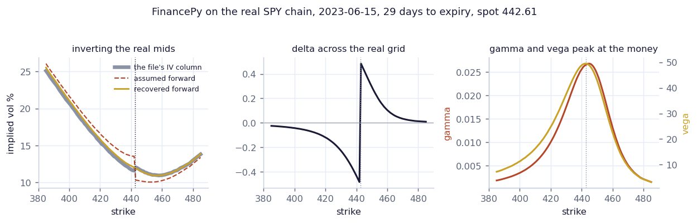

# Six Free Volatility and Option Models

A tour of six open-source libraries for volatility and options: arch for GARCH, QuantLib, FinancePy, tf-quant-finance, gs-quant, and an SVI fit on a real chain.



## Run

```bash
pip install -r ../requirements.txt
py -3 model.py
```

Each library installs separately. Read the header of a script before running it: `pip install arch QuantLib-Python financepy tf-quant-finance gs-quant`.

## What is inside

- Files: one script per library, taken from the write-up
- Data: Free market data: Cboe delayed quotes, yfinance, and Kaggle SPY chains for the surface fit

## Write-up

Full explanation, step by step, with the charts: [https://davidariasfinance.com/scripts/volatility-models/](https://davidariasfinance.com/scripts/volatility-models/)

## License

MIT, see [LICENSE](../LICENSE).
