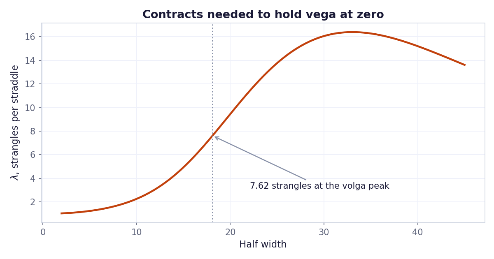

# Volga Convexity Spread

Where the convexity of a short strangle actually sits, and how wing width changes net volga.



## Run

```bash
pip install -r ../requirements.txt
py -3 model.py
```

Charts are written to `charts/`.

## What is inside

- Files: model.py
- Data: Smile fitted from a real SPY chain

## Write-up

Full explanation, step by step, with the charts: [https://davidariasfinance.com/scripts/volga-convexity-spread/](https://davidariasfinance.com/scripts/volga-convexity-spread/)

## References

- Write-up: https://davidariasfinance.com/scripts/volga-convexity-spread/

## License

MIT, see [LICENSE](../LICENSE).
