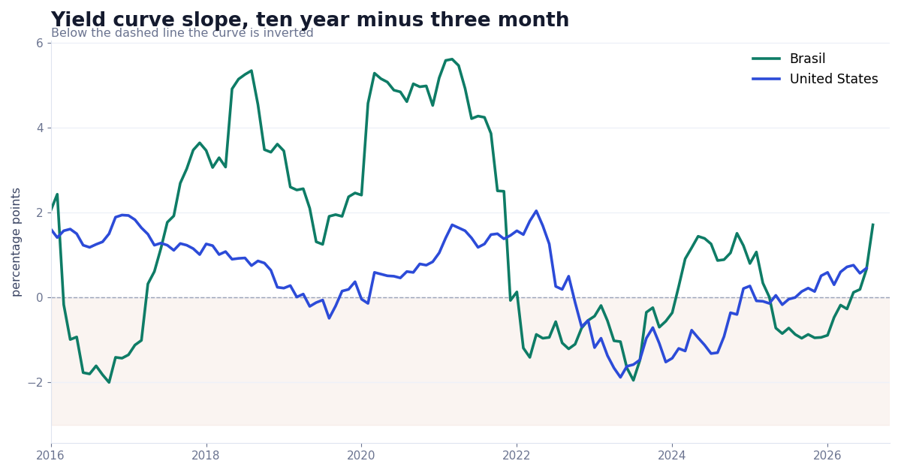

# Yield Curves, US and Brazil

The US curve from FRED and the Brazilian curve from Tesouro Direto and the central bank, with a Nelson Siegel Svensson fit where the Brazilian data is sparse.



## Run

```bash
pip install -r ../requirements.txt
py -3 model.py
```

Set FRED_API_KEY in the environment. The Tesouro Direto file is about 14 MB and downloads from their open data page.

## What is inside

- Files: model.py
- Data: FRED (free API key), BCB SGS series 432, and the Tesouro Direto CSV

## Write-up

Full explanation, step by step, with the charts: [https://davidariasfinance.com/scripts/yield-curve-us-brazil/](https://davidariasfinance.com/scripts/yield-curve-us-brazil/)

## License

MIT, see [LICENSE](../LICENSE).
